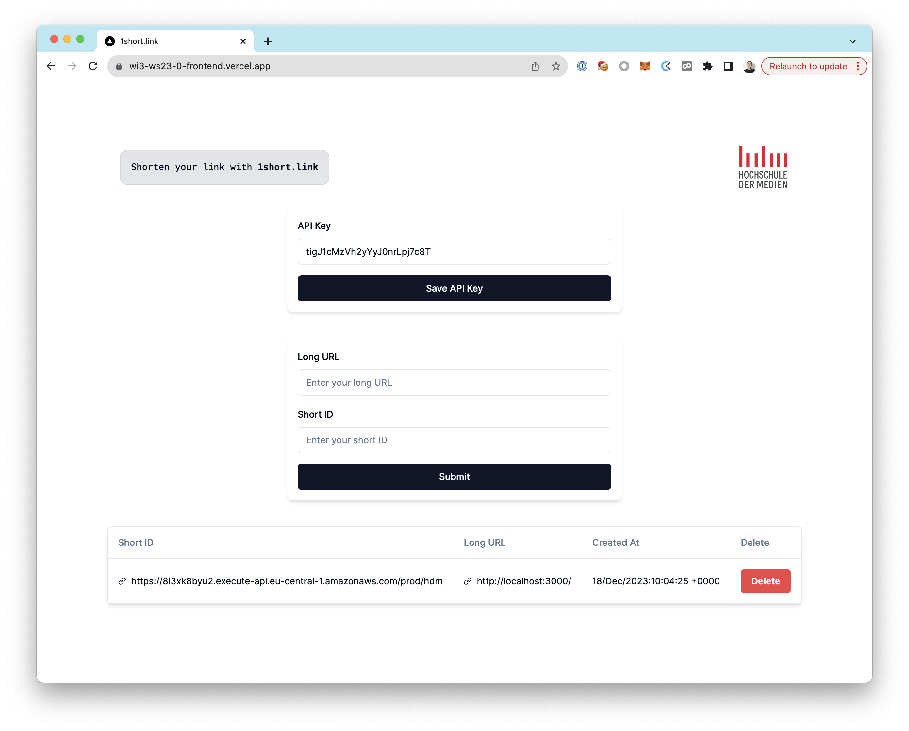

# URL Shortener Frontend with Next.JS and Vercel



## Getting Started

This is a [Next.js](https://nextjs.org/) project bootstrapped with [`create-next-app`](https://github.com/vercel/next.js/tree/canary/packages/create-next-app).

### Prerequisites

Copy the `.env.local.example` file to `.env.local` and fill in the environment variables.

```bash
cp .env.local.example .env.local
```

Install the dependencies with npm:

```bash
npm install
```

### Run locally

Then, run the development server:

```bash
npm run dev
```

Open [http://localhost:3000](http://localhost:3000) with your browser to see the result.

### Deploy on Vercel

The easiest way to deploy your Next.js app is to use the [Vercel Platform](https://vercel.com/new) from the creators of Next.js.

Check out the [Next.js deployment documentation](https://nextjs.org/docs/deployment) for more details.

## App Structure

The app is structured as follows:

### `/app`-directory

- `layout.tsx`: This file contains the root layout of this application. It might include elements like the header, footer, and navigation that are shared across different pages.

- `page.tsx`: This file is the landing page of this application.

- `main.tsx`: This file is the main component of this application. It contains the components `SetAPIKeyForm`, `ShortenUrlForm` and `ShortenedUrlsTable` that users see when they visit the home page.

- `shortenUrlForm.tsx`: This file contains a form for shortening URLs. It includes input fields for the long URL, the short ID and an action button to submit the form.

- `table.tsx`: This file contains a table component for the `ShortenedUrlsTable` component. The table is used to display a list of shortened URLs.

  - `tableColumns.tsx`: This file defines the columns for the table in `table.tsx`. Each column definition include the column header and how to access and display the data for that column.

- `updateApiKey.tsx`: This file contains for updating the users API key this session. It might include an input field for the new key and an action button to submit the update.

- `models/shortenedUrl.tsx`: This file defines the data model for a shortened URL. It include the original URL, the short ID, and other relevant data.

### `/components`-directory

This directory contains components that are used across different pages. The components are installed from the [Shadcn UI](https://ui.shadcn.com) library.
First, install the Shadcn UI library:

```bash
npm install shadcn-ui
```

The components are installed with the following command:

```bash
# npx shadcn-ui@latest add [component-name]
npx shadcn-ui@latest add button
```

### `/lib`-directory

This directory contains utility functions that are used across different pages.

- `api/shortenUrls.tsx`: This file contains functions for making API calls to the backend.
- `utils.ts`: This file contains utility functions for this application.

### `/public`-directory

This directory contains static files that are served at the root of the application.

